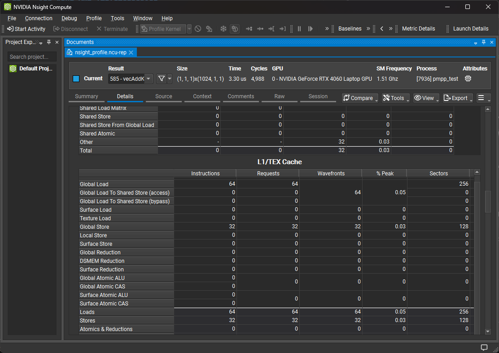

# Task 1: CUDA Programming

High performance gemm implementation on Nvidia A100 ([internal feishu doc](https://aicarrier.feishu.cn/wiki/EvivwNtVRij2XVk0i36cBN8Bn1f)).

## 1. Target

Implement a high performance gemm (General Matrix Multiply) function with CUDA on Nvidia A100 for float32 and float16 data types.

The implementation should be able to achieve at least **90%** of the performance of cuBLAS, with the given benchmarking structure.

## 2. Benchmark cBlas and cuBlas

Build example matmul with the following commands (`v0 -> cblas`; `v1 -> cublas`):

```bash
# Build gemm implemented with CBLAS (CPU) under float32:
bash scripts/build-task1.sh -f32 -v0
# Build gemm implemented with CBLAS (CPU) under float16:
bash scripts/build-task1.sh -f16 -v0
# Build gemm implemented with cublas (CUDA) under float32:
bash scripts/build-task1.sh -f32 -v1
# Build gemm implemented with cublas (CUDA) under float16:
bash scripts/build-task1.sh -f16 -v1
```

For more compile options, see "[./scripts/build-task1.sh](../scripts/build-task1.sh)".

> 💡**Note**:  
> 1. Please install the following extensions in VSCode:
>    - llvm-vs-code-extensions.vscode-clangd
>    - twxs.cmake
>    - josetr.cmake-language-support-vscode
> 2. It is suggested to restart clangd server after building (to avoid some code analysis errors).  
> To restart clangd server, press `Ctrl+Shift+P` in VSCode, and select `clangd: Restart language server`.  
> 

Run the binarys in "[./build/src](../build/src)" directory to get the benchmark results.

You can set `m`, `n`, `k`, `n_warmup` and `n_test` by passing arguments to binarys built in this task. Use `-h` to print help messages:

```bash
# Run the binary but showing help messages only
./build/src/task1_float16_v0 -h
```

## 3. Add Your Own Implementation

Create a `.cu` file under directory "[./task-1/src](./src)" with any name you like, and implement a matmul function with macro `PLAYGROUND_MATMUL_DEC`.

For example, add the following lines in "./task-1/src/xxx/xxx/f16-v2.cu" to provide the definition for function `matmul<float16_t, 2>`:

```cpp
// @file: ./task-1/src/xxx/xxx/f16-v2.cu

#include "playground/matmul.hpp"

namespace playground {
// Implement the matmul function with DType=float16_t and Version=2
PLAYGROUND_MATMUL_DEC(float16_t, 2, A, B, C, M, N, K)
{
    // ......
}
}
```

> 💡**Note**:  
> Do not use version `0` and `1` because they are for cblas and cublas respectively.

Now you are able to build a new binary `task1_float16_v2` to with the following command:

```bash
# Build the test binary with DType=float16 and Version=2:
bash ./scripts/build.sh -v2 -f16
# Run the test binary
./build/src/task1_float16_v2
```

## 4. Profile Your Kernel with Nsight Compute

Use "[scripts/nsight-profile.sh](../scripts/nsight-profile.sh)" to profile an binary which contains **a self-defined cuda kernel**.

⚠️ **The profiled binary must be built with `RelWithDebInfo` or `RD` flag**. 

For example, to build matmul kernel with `DType=float16`, `Version=2` and `RD` flag:

```bash
# `RD` is the same as `RelWithDebInfo`
bash ./scripts/build-task1.sh RD -f16 -v2 
```

Then you can profile the binary with `ncu` with a tool script:

```bash
bash ./scripts/nsight-profile.sh -t build/src/task1_float16_v2
```

A `.ncu-rep` file will be generated in the current directory. Download it to your local machine and open it with Nsight Compute GUI.



## 5. Example Target Results

### CUDA Core(FP32)
| Version | v0 | v1 | v2 | v3 | v4 | cuBLAS | Theory Peak |
| --- | --- | --- | --- | --- | --- | --- | --- | 
| Average error | 0.0115 | 0.0115 | 0.0115 | 0.0116 | 0.0116 | / | / |
| TFLOPS | 2.41 | 3.85 | 9.24 | 15.15 | 17.16 | 18.38 | 19.5 |

### Tensor Core(FP16)

| Version | v0 | v1 | v2 |  v3 |v4 | cuBLAS | Theory Peak |
| --- | --- | --- | --- | --- | --- | --- | --- |
| Average error | 0.0117 | 0.0117 | 0.0117 | 0.0117 | 0.0019 |0.0153 | / |
| TFLOPS | 18.09 | 53.05 |103.05 |159.35 | 213.12 |222.11 | 312 |

> 💡**Note**:  
> Some card can reach above 250 TFLOPS using cuBLAS fp16. The target is the 90% of cuBLAS on the same card

## 6. References
See also: [feishu doc: cuda学习资料](https://aicarrier.feishu.cn/wiki/SFdnw61vHi1AfRkeJVecgMjBnrc)

### CUDA Core

- "Programming Massively Parallel Processors  A Hands-on Approach (Fourth Edition)" Chapter 2-3

- "Programming Massively Parallel Processors  A Hands-on Approach (Fourth Edition)" Chapter 4-5
- [CUDA编程入门及优化](https://zhuanlan.zhihu.com/p/441146275) 1.2 Thread Block Tile: 利用 Shared Memory 减少重复访存

- "Programming Massively Parallel Processors  A Hands-on Approach (Fourth Edition)" Chapter 6-6.3 Thread coarsening
- [how-to-optimize-gemm](https://zhuanlan.zhihu.com/p/478846788) MMult_cuda_4 & MMult_cuda_5
- [CUDA 矩阵乘法终极优化指南](https://zhuanlan.zhihu.com/p/410278370) Naive 实现的分析：到底差在哪里？

- "Programming Massively Parallel Processors  A Hands-on Approach (Fourth Edition)" Chapter 6-6.1 Memory coalescing, 6.2 Hiding memory latency
- [how-to-optimize-gemm](https://zhuanlan.zhihu.com/p/478846788) MMult_cuda_9
- [cuda/MMult_cuda_9.cu](https://github.com/tpoisonooo/how-to-optimize-gemm/blob/master/cuda/MMult_cuda_9.cu)
- [CUDA 矩阵乘法终极优化指南](https://zhuanlan.zhihu.com/p/410278370) 极致的访存优化
- [CUDA编程入门及优化](https://zhuanlan.zhihu.com/p/441146275) 1.3 Warp Tile 与 Thread Tile: 利用寄存器消除 Shared Memory 瓶颈


- [how-to-optimize-gemm](https://zhuanlan.zhihu.com/p/478846788) MMult_cuda_12
- [cuda/MMult_cuda_12.cu](https://github.com/tpoisonooo/how-to-optimize-gemm/blob/master/cuda/MMult_cuda_12.cu)
- [CUDA编程入门及优化](https://zhuanlan.zhihu.com/p/441146275) 1.4 Double Buffer: 让 GEMM 流水并行起来

### Tensor Core

- [cuda学习：学习nvcuda::wmma实现高效gemm](https://zhuanlan.zhihu.com/p/353208013) simple version

- [cuda学习：学习nvcuda::wmma实现高效gemm](https://zhuanlan.zhihu.com/p/353208013) sample version with detailed annotations
- [Official sample provided by NVIDIA](https://github.com/NVIDIA/cuda-samples/blob/master/Samples/3_CUDA_Features/cudaTensorCoreGemm/cudaTensorCoreGemm.cu)

- [Nvidia Tensor Core-CUDA HGEMM优化进阶](https://zhuanlan.zhihu.com/p/639297098/) 4.5 提高L2 Cache命中率
- [一步步优化 GEMM by Tensorcore](https://zhuanlan.zhihu.com/p/638522893) 调整线程块分配到的计算位置(swizzle)


#### Source code:
- [src/wmma/wmma_async_stage3.cu](https://github.com/Bruce-Lee-LY/cuda_hgemm/blob/master/src/wmma/wmma_async_stage3.cu) 3 stages pipeline with WMMA API

Asynchronous data copy:
- [ Data Movement and Conversion Instructions: cp.async](https://docs.nvidia.com/cuda/parallel-thread-execution/index.html#data-movement-and-conversion-instructions-cp-async) To know the usage of cp.async instructions
- [Performance Guidance for memcpy_async](https://docs.nvidia.com/cuda/parallel-thread-execution/index.html#data-movement-and-conversion-instructions-cp-async) To know the usage of asynchronous data copy

#### Multi-buffer with prefetching:
- [Nvidia Tensor Core-CUDA HGEMM优化进阶](https://zhuanlan.zhihu.com/p/639297098) 5 Pipeline优化-5.2 Stage
- [一步步优化 GEMM by Tensorcore](https://zhuanlan.zhihu.com/p/638522893) 使用数据预取(prefetch)

#### Permute to use memory coalescing and avoid bank conflicts:
- [cuda（cutlass）编程之swizzle](https://www.bilibili.com/video/BV1Jb421e7UN/?spm_id_from=333.999.0.0&vd_source=2fe7991a33356057a2e41a2d37f9b7e0) A more detailed video explanation of swizzle based on CUTLASS

### For Further Study

- [基于 CUTE 的 GEMM 优化【1】—— Baseline 实现](https://zhuanlan.zhihu.com/p/695063154)
- [基于 CUTE 的 GEMM 优化【2】—— 高效 GEMM 实现，超越 Cublas 20%](https://zhuanlan.zhihu.com/p/696028389)
- [cute系列讲解](https://www.zhihu.com/people/reed-84-49/posts)

